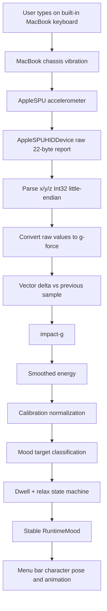
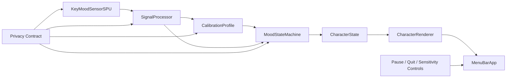

# KeyMood 개발 계획

## 1. 제품 정의

KeyMood는 **MacBook typing-force based menu bar mood companion**이다. 사용자의 타자 내용이 아니라, MacBook 본체에 전달되는 물리적 타자 세기와 진동을 읽어서 메뉴바의 작은 캐릭터가 현재 감정 상태를 대변하게 만든다.

초기 버전은 AI 모델을 넣지 않는다. AppleSPU accelerometer signal과 `threshold + dwell + relax` 방식의 deterministic state machine으로 시작한다. 사용자에게 보이는 regime은 `Dead Slow`, `Slow Ahead`, `Half Ahead`, `Full Ahead`, `Standby`를 기본으로 한다.

제품의 핵심 차별점은 다음이다.

- 키 입력 내용이 아니라 물리적 typing dynamics를 해석한다.
- App Store보다 direct distribution을 먼저 목표로 잡는다.
- AI 모델 없이도 빠르고 설명 가능한 mood state를 만든다.
- 메뉴바에서 RunCat처럼 항상 작게 살아 있는 companion 경험을 제공한다.

## 2. 현재 구현 상태

현재 프로젝트는 Swift Package 기반 CLI probe에서 시작했고, 지금은 macOS menu bar app과 local app bundle packaging까지 포함한다.

```text
/Users/junseokism/Documents/New project/keymood
├── Package.swift
├── README.md
├── PLAN.md
├── scripts
│   └── build_app_bundle.sh
├── Sources
    ├── KeyMoodCore
    │   ├── CalibrationProfile.swift
    │   ├── CharacterState.swift
    │   ├── MoodStateMachine.swift
    │   ├── MotionSignal.swift
    │   └── SignalProcessor.swift
    ├── KeyMoodSensor
    │   ├── RawMotionCaptureState.swift
    │   └── SensorService.swift
    ├── KeyMoodMenuBar
    │   ├── main.swift
    │   ├── MenuBarController.swift
    │   ├── MenuBarIconRenderer.swift
    │   ├── MenuBarIconStyle.swift
    │   ├── MenuBarPresentation.swift
    │   └── MenuBarSensitivity.swift
    └── KeyMoodProbe
        ├── main.swift
        ├── ProbeFormatting.swift
        └── ProbeState.swift
└── Tests
    └── KeyMoodCoreTests
        └── MoodStateMachineTests.swift
```

현재 검증된 명령:

```bash
swift build
swift run keymood-probe sensors
swift run keymood-probe raw-stream --seconds 10
swift run keymood-probe mood-stream --seconds 30 --dwell 1.0
swift run keymood-probe calibrate --rounds 2 --repeats 3
swift run keymood-menubar
```

현재 기술 상태:

- `raw-stream`은 `AppleSPUHIDDevice` 중 `usagePage=0xFF00`, `usage=3` raw accelerometer report를 읽는다.
- raw report는 22-byte HID report로 관찰되었다.
- `x/y/z`는 byte offset `6`, `10`, `14`에서 `Int32 little-endian`으로 파싱한다.
- 파싱한 raw 값은 `65536.0`으로 나누어 g-force로 변환한다.
- 연속 vector delta에서 `impact-g`를 계산한다.
- `impact-g`를 normalization한 뒤 exponential smoothing으로 `smoothedEnergy`를 만든다.
- `mood-stream`은 `energy/impact`를 `MoodStateMachine`에 넣어 runtime mood를 출력한다.
- `Full Ahead`는 순간 spike로 바로 확정하지 않고 dwell window 이상 high-impact target이 유지될 때만 확정한다.
- high-impact 상태가 끝나면 바로 `Dead Slow`로 떨어지지 않고 `Standby`를 거쳐 pose energy가 감쇠된다.

현재 빌드 상태:

- `swift build` 통과.
- `swift test` 통과.
- CLI command surface는 유지됨.
- 코드가 `KeyMoodCore` library target과 `KeyMoodProbe` executable target으로 분리됨.
- AppleSPU sensor access는 `KeyMoodSensor` library target으로 분리됨.
- `MoodStateMachine`, `SignalProcessor`, raw motion model, calibration schema, character state seed는 `KeyMoodCore`에 위치함.
- `SensorService`, `AppleSPUSensorReader`, raw capture state는 `KeyMoodSensor`에 위치함.
- terminal presentation state는 `KeyMoodProbe`에 위치함.
- menu bar companion app은 `KeyMoodMenuBar` executable target으로 분리됨.
- menu bar status item은 AppKit vector-rendered submarine icon을 표시함.
- sensitivity UI 정책은 `MenuBarSensitivity`에 묶여 slider range, default, multiplier가 한 곳에서 관리됨.
- GitHub release용 local app bundle script가 `scripts/build_app_bundle.sh`에 있음.

## 3. Processing Pipeline



## 4. Architecture Plan



### KeyMoodCore

앱과 CLI가 공유하는 순수 core module이다. 가능한 한 IOKit, AppKit, SwiftUI에 직접 의존하지 않는다.

포함 예정:

- `RawMotionVector`
- `RawMotionSnapshot`
- `SignalProcessor`
- `RuntimeMood`
- `MoodStateMachine`
- `CalibrationProfile`
- `CharacterState`

제외 예정:

- AppleSPU raw device opening
- CFRunLoop scheduling
- menu bar UI
- app packaging
- notarization logic

### KeyMoodSensorSPU

AppleSPU raw accelerometer 접근을 캡슐화한다. 현재 `SensorService.swift`에 있는 IOKit 코드를 앱에서 재사용 가능한 reader/service 형태로 정리한다.

핵심 책임:

- `AppleSPUHIDDriver` wake
- `AppleSPUHIDDevice` 검색
- `usagePage=0xFF00`, `usage=3` accelerometer device open
- raw input report callback 등록
- callback buffer lifetime 관리
- CFRunLoop scheduling
- sensor start/stop lifecycle 제공

중요 구현 계약:

- sensor reader는 typed text, key code, key name을 절대 다루지 않는다.
- sensor reader는 raw report나 vector signal만 방출한다.
- 앱 종료, pause, sleep 상황에서 device를 닫을 수 있어야 한다.
- raw sensor 접근 실패 시 crash하지 않고 user-facing 상태를 반환한다.

### SignalProcessor

raw report parsing과 signal feature 계산을 담당한다.

입력:

- raw report bytes
- previous vector
- optional calibration profile

출력:

- `RawMotionVector`
- `impact-g`
- `smoothedEnergy`
- `peakImpact`
- `averageImpact`

현재 공식처럼 유지할 값:

```text
report length >= 18
x offset = 6
y offset = 10
z offset = 14
scale = 65536.0
energy smoothing = previous * 0.82 + normalized * 0.18
```

추후 calibration이 들어가면 threshold를 고정값이 아니라 사용자별 baseline 기준으로 조정한다.

### MoodStateMachine

`threshold + dwell + relax` 기반 runtime mood 전환을 담당한다. AI 모델을 넣기 전까지는 deterministic rule engine으로 유지한다.

현재 기본 상태명은 코드 안정성을 위해 내부 enum과 사용자 표시명을 분리한다.

| Internal `RuntimeMood` | User-facing regime |
|---|---|
| `calm` | `Dead Slow` |
| `focused` | `Slow Ahead` |
| `charged` | `Half Ahead` |
| `intense` | `Full Ahead` |
| `relaxing` | `Standby` |

전환 원칙:

- 약한 신호는 `Dead Slow`.
- 중간 신호는 `Slow Ahead`.
- 강한 짧은 spike는 `Half Ahead`.
- 강한 신호가 dwell window 이상 지속되면 `Full Ahead`.
- `Full Ahead` 이후 신호가 내려가면 `Standby`.
- `Standby`는 pose energy를 천천히 낮춘 뒤 `Slow Ahead` 또는 `Dead Slow`로 복귀.

앱에서 중요한 점:

- 캐릭터 표정은 raw signal이 아니라 committed `RuntimeMood`를 따른다.
- 캐릭터 움직임 강도는 `poseEnergy`를 따른다.
- 순간 spike만으로 과하게 반응하면 안 된다.

### CalibrationProfile

사용자와 기기별 차이를 보정한다. MacBook 모델, 키보드 상태, 책상 재질, 사용자의 타자 습관에 따라 raw signal이 달라질 수 있으므로 calibration은 필수에 가깝다.

저장 가능한 값:

- schema version
- created/updated timestamp
- device model hint
- soft baseline peak/avg
- normal baseline peak/avg
- firm baseline peak/avg
- computed focused threshold
- computed charged threshold
- computed intense threshold
- dwell seconds
- relax speed

저장하면 안 되는 값:

- typed text
- key code
- key name
- prompt/content
- app별 입력 내용

저장 위치 후보:

```text
~/Library/Application Support/KeyMood/calibration.json
```

SwiftUI/AppKit app에서는 `Application Support` 안에 저장하고, CLI에서는 같은 schema를 읽고 쓰게 만든다.

### CharacterState

`RuntimeMood`를 실제 캐릭터 표현으로 바꾸기 위한 중간 모델이다. UI가 직접 `MoodStateMachine` 내부 값을 해석하지 않게 한다.

예시:

```text
Dead Slow  -> idle frame, low bounce, neutral color
Slow Ahead -> faster blink, slight forward pose
Half Ahead -> higher bounce, alert color
Full Ahead -> strong shake, hot color, sharper expression
Standby    -> slow breathing, cooling color, reduced shake
```

### CharacterRenderer

캐릭터를 실제 화면에 그리는 계층이다.

현재 구현:

- AppKit vector drawing 기반 status-item submarine icon
- 상태별 propeller, body bob/shake, smoke, wake, flame-eye parameter
- timer tick 기반 lightweight frame animation
- SVG asset은 문서/디자인 reference로 유지

주의:

- menu bar에서는 너무 큰 UI를 만들지 않는다.
- battery drain을 줄이기 위해 animation tick은 필요한 수준으로 제한한다.
- 상태가 바뀌지 않을 때는 redraw를 줄인다.

### MenuBarApp

최종 사용자 앱이다. SwiftUI `MenuBarExtra` 또는 AppKit `NSStatusItem` 중 하나로 구현한다.

필수 기능:

- menu bar character 표시
- current mood display
- pause/resume
- calibration 시작
- sensitivity 조정
- launch at login은 나중에 opt-in으로만 제공
- quit
- sensor unavailable 안내

중요:

- Swift Package executable만으로는 일반적인 `.app` bundle 배포가 부족하다.
- 실제 macOS 앱은 Xcode macOS App target 또는 별도 app bundle packaging 흐름을 두는 편이 안전하다.
- direct distribution을 목표로 하므로 `.app`, `.dmg`, code signing, notarization까지 고려해야 한다.

## 5. Development Roadmap

### Phase 1: CLI Probe Stabilization

Status: mostly done.

목표:

- 현재 CLI command surface 유지.
- `sensors`, `stream`, `raw-stream`, `mood-stream`, `calibrate` 동작 보존.
- `swift build` 통과.
- README 명령과 실제 명령 일치.

완료 조건:

- `swift build` passes.
- `raw-stream` receives reports on supported MacBook.
- `mood-stream` prints stable `target/state`.
- `calibrate` prints soft/firm comparison graph.

### Phase 2: Module Boundary Cleanup

Status: done.

목표:

- `main.swift`는 CLI routing과 printing만 담당.
- sensor IOKit 접근은 `SensorService` 또는 `AppleSPUSensorReader`로 격리.
- parsing/energy 계산은 `SignalProcessor`로 격리.
- mood transition은 `MoodStateMachine`으로 격리.
- app target이 core logic을 재사용할 수 있게 준비.

완료된 세부 작업:

- `RawMotionCaptureState`를 CLI output state와 sensor capture state로 더 명확히 분리.
- `SensorService.openRawAccelerometerDevices` 위에 `AppleSPUSensorReader.start/poll/stop` lifecycle API 추가.
- CLI printing 함수와 core model을 분리.
- `KeyMoodCore` library target 추가.

완료 조건:

- `swift build` passes.
- CLI 출력은 기존과 동일하거나 더 명확함.
- core logic에 `print`가 섞이지 않음.
- sensor lifecycle이 `start()`, `stop()`으로 표현 가능.

### Phase 3: SwiftPM Menu Bar MVP

Status: implemented and build-tested.

목표:

- App Store나 DMG packaging 전에 `swift run keymood-menubar`로 실행 가능한 macOS menu bar MVP 생성.
- macOS 상단 메뉴바에 RunCat처럼 작은 submarine companion icon 표시.
- `RuntimeMood`를 menu bar 표시로 연결.
- 센서가 켜져 있으면 mood가 실시간으로 변한다.
- 사용자가 pause/resume/quit 가능.
- 사용자가 직접 타자 세기에 따라 `Dead Slow/Slow Ahead/Half Ahead/Full Ahead/Standby` 전환을 테스트할 수 있어야 한다.

구현 접근:

- Swift Package executable product `keymood-menubar` 사용.
- SwiftPM 실행에 안정적인 AppKit `NSStatusItem` 사용.
- `KeyMoodCore`와 `KeyMoodSensor`를 shared package/library로 연결.
- menu bar UI는 native `NSMenu`를 유지.

MVP 화면:

- menu bar item: selected character icon plus short regime label.
- menu: current mood, sensitivity, pause/resume, quit.

완료 조건:

- `swift run keymood-menubar` 실행 시 menu bar에 표시됨.
- `mood-stream`과 같은 state transition을 앱에서도 볼 수 있음.
- pause 상태에서 sensor callback이 멈춤.
- quit 시 device가 닫힘.
- 사용자가 직접 Mac 상단 메뉴바에서 typing-force 반응을 확인함.
- 사용자가 “ㅇㅋ”라고 한 뒤 Figma/Apple Design Resources 기반 UX/UI 디자인으로 넘어감.

### Phase 4: Calibration Flow

목표:

- 첫 실행 또는 설정에서 calibration을 수행.
- soft/normal/firm typing baseline을 저장.
- 사용자별 threshold를 계산.

권장 flow:

```text
1. Ready screen
2. Soft typing round
3. Normal typing round
4. Firm typing round
5. Threshold preview
6. Save profile
```

완료 조건:

- calibration data가 Application Support에 저장됨.
- typed text/key code는 저장되지 않음.
- profile이 없으면 기본 threshold로 동작.
- profile이 있으면 threshold가 사용자 기준으로 조정됨.

### Phase 5: Character Design and Renderer

목표:

- 캐릭터 상태 mapping 확정.
- mood별 visual behavior 구현.
- RunCat처럼 작지만 살아 있는 느낌을 만든다.

MVP asset 전략:

- 현재는 AppKit vector-rendered frames 사용.
- SVG는 디자인 reference asset으로 유지.
- 캐릭터는 제품 정체성이므로 SlapMac/RunCat asset을 모방하지 않는다.

완료 조건:

- `RuntimeMood`마다 명확한 visual difference가 있음.
- committed mood와 icon style parameter가 직접 연결됨.
- Dead Slow/Standby 전환이 갑작스럽지 않음.

### Phase 6: Direct Distribution Packaging

목표:

- Mac App Store가 아니라 direct download first로 배포 준비.
- `.app` bundle과 release zip 생성 흐름 정리.

필요 항목:

- bundle identifier
- app icon
- version/build number
- privacy policy URL
- download page
- release notes
- updater는 MVP 이후 검토

완료 조건:

- 로컬에서 `.app` 실행 가능.
- GitHub release artifact로 올릴 수 있는 `.zip` 생성 가능.
- `.dmg`는 이후 필요하면 추가.
- sensor permission/access failure 안내가 명확함.

### Phase 7: Developer ID Signing and Notarization

목표:

- Gatekeeper 경고를 줄이는 direct distribution 상태 만들기.

필요 항목:

- Apple Developer Program membership
- Developer ID Application certificate
- hardened runtime 설정
- code signing
- notarization upload
- stapling
- signed/notarized DMG 검증

완료 조건:

- 깨끗한 Mac에서 다운로드 후 실행 가능.
- quarantine 상태에서도 정상 실행.
- notarization log에 blocking issue 없음.

### Phase 8: Mac App Store Target Review

목표:

- 직접 배포 버전이 안정화된 뒤 별도 App Store target 가능성 평가.

리스크:

- AppleSPU raw sensor는 public API가 아니다.
- Mac App Store 앱은 sandbox requirement가 강하다.
- root 권한 요청은 금지된다.
- raw IOKit 접근이 심사에서 reject될 수 있다.

전략:

- App Store target은 direct distribution target과 분리.
- raw sensor access 실패 시 fallback mode 준비.
- fallback 후보는 keyboard rhythm, manual mood, timer-based focus companion 등.
- App Review Notes에 hardware requirement와 privacy behavior를 명확히 설명.

완료 조건:

- App Store target이 direct distribution target을 망가뜨리지 않음.
- sandbox에서 무엇이 가능한지 실험 결과가 문서화됨.

## 6. Privacy and Safety Contract

KeyMood는 사용자의 입력 내용을 감정 분석하지 않는다. 제품 철학과 구현 모두에서 아래 계약을 지켜야 한다.

금지:

- typed text 저장
- key code 저장
- key name 저장
- prompt/content 분석
- app별 입력 내용 추적
- 원격 서버로 sensor signal 전송
- 사용자가 모르는 background persistence

허용:

- local raw accelerometer signal 처리
- aggregate peak/avg/threshold 저장
- calibration profile 저장
- 사용자가 켠 동안 menu bar companion state 표시

사용자 제어:

- pause
- resume
- quit
- calibration reset
- sensitivity reset
- sensor unavailable 안내

## 7. Distribution Strategy

처음부터 Mac App Store만 목표로 잡지 않는다.

1차 목표:

- direct distribution
- Developer ID signing
- notarization
- stapled DMG
- 다운로드 페이지

이유:

- SlapMac/spank류 앱은 주로 direct download, GitHub release, DMG 방식으로 배포된다.
- AppleSPU raw sensor 접근은 Mac App Store sandbox/public API 심사 리스크가 있다.
- 직접 배포에서는 MacBook 전용 raw sensor 기능을 먼저 완성할 수 있다.

2차 목표:

- Mac App Store 별도 target 검토.
- raw sensor가 막히는 경우 fallback 기능 버전으로 전환.

## 8. Current Checklist

- [x] AppleSPU raw accelerometer report 수신
- [x] raw x/y/z parsing
- [x] impact-g 계산
- [x] smoothed energy 계산
- [x] `mood-stream` 상태 머신 연결
- [x] `main.swift` 1차 분리
- [x] `SensorService.swift` 추가
- [x] `SignalProcessor.swift` 추가
- [x] `MoodStateMachine.swift` 추가
- [x] `swift build` 통과
- [x] `RawMotionCaptureState`와 CLI presentation 책임 분리
- [x] `KeyMoodCore` library target 설계
- [x] sensor lifecycle API 설계
- [x] `CalibrationProfile` schema 설계
- [x] `KeyMoodSensor` shared library target 추가
- [x] `keymood-menubar` SwiftPM executable target 추가
- [x] AppKit vector submarine icon renderer 구현
- [x] character icon + short regime label status item 구현
- [x] current regime row와 sensitivity slider 연결
- [x] state-machine regression test 추가
- [ ] Application Support 저장소 설계
- [x] direct distribution packaging script 초안
- [ ] signing/notarization 문서 초안

## 9. Next Implementation Intent

현재 구현 intent:

```text
/Users/junseokism/Documents/New project/keymood 폴더에서 작업해줘.

목표:
1. `swift run keymood-menubar` 동작을 유지한다.
2. menu bar status item은 선택된 character icon + short regime label로 유지한다.
3. AppleSPU sensor와 `MoodStateMachine` 연결을 깨지 않으며 `Dead Slow/Slow Ahead/Half Ahead/Full Ahead/Standby` 상태가 바뀌게 한다.
4. pause/resume/quit과 sensitivity slider를 유지한다.
5. 기존 `keymood-probe` 명령은 깨지지 않게 유지한다.
6. `swift build`, `swift test`, `./scripts/build_app_bundle.sh`를 통과시킨다.

하지 말 것:
- AI 모델을 추가하지 마.
- typed text, key code, key name을 읽거나 저장하지 마.
- App Store/DMG/notarization은 별도 작업으로 분리한다.

완료 후:
- 변경 파일 요약
- 실행한 검증 명령
- 남은 배포 리스크 명시
```
