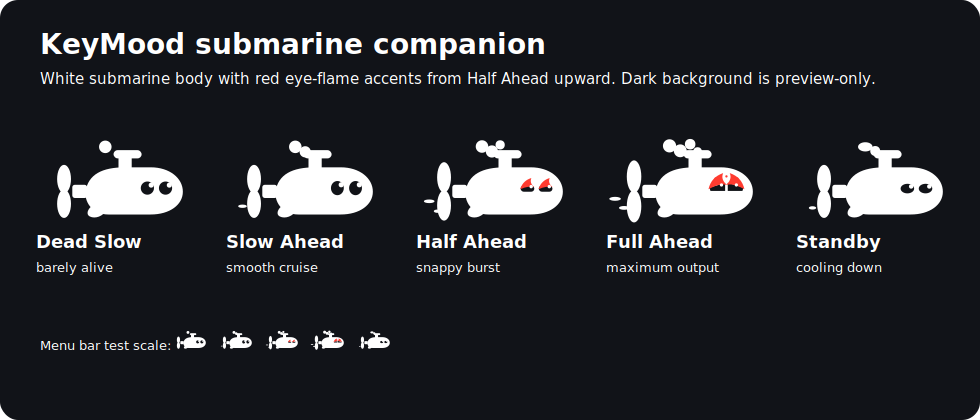

# KeyMood

KeyMood is a local-first macOS experiment that turns typing dynamics into a small menu-bar mood companion.

## Distribution Status

KeyMood is currently an experimental alpha for local testing and developer-to-developer GitHub releases. It is intended for MacBooks with AppleSPU motion-sensor access. Desktop Macs and unsupported MacBook models may show `No Sensor` even when the app launches correctly.

Release archives built by the default script are ad-hoc signed for local testing. Public macOS distribution should use a Developer ID Application certificate and Apple notarization.

The first milestone was the raw sensor probe that answers one question:

> Can this MacBook expose enough motion signal to detect typing force without reading typed text?

## Probe

List HID/SPU sensor candidates:

```bash
swift run keymood-probe sensors
```

Stream AppleSPU raw accelerometer impact energy for 15 seconds:

```bash
swift run keymood-probe raw-stream --seconds 15
```

Convert the signal into a stable runtime mood:

```bash
swift run keymood-probe mood-stream --seconds 30 --dwell 1.0
```

`mood-stream` separates raw signal from character pose. Short spikes can become `Half Ahead`, but `Full Ahead` only commits after the high-impact target stays active for the dwell window. When the signal drops, the visible pose settles into `Standby` instead of snapping back to `Dead Slow`.

The legacy generic HID stream is still available for comparison:

```bash
swift run keymood-probe stream --seconds 15
```

Run the local menu bar app:

```bash
swift run keymood-menubar
```

The menu bar app shows an animated character icon. It does not display typed text, key names, or key codes. Click the icon to open the native macOS menu with a read-only regime rail, character selection, the current regime, sensitivity slider, Roaming Mode switch, pause/resume, and quit actions. Roaming Mode makes the selected character travel to each edge of its menu bar track before reversing direction.

## Sensitivity

The menu includes a `Sensitivity` slider from 0 to 100. It scales the local motion signal before the mood state machine classifies the current regime.

- Lower values make KeyMood calmer and reduce accidental jumps into `Half Ahead` or `Full Ahead`.
- Higher values make KeyMood react to lighter typing and smaller desk vibrations.
- The slider does not read typed text, key names, key codes, or app content.
- There is no required first-run calibration flow in the MVP. If the character feels too quiet or too intense on a supported MacBook, adjust `Sensitivity` from the menu.

Runtime naming is split on purpose. The internal state machine keeps compact semantic cases for code stability, while all user-facing output uses engine-telegraph labels:

| Internal state | User-facing regime |
|---|---|
| `calm` | `Dead Slow` |
| `focused` | `Slow Ahead` |
| `charged` | `Half Ahead` |
| `intense` | `Full Ahead` |
| `relaxing` | `Standby` |

First character direction:



The transparent SVG state assets live in `docs/assets/character/`: mostly white body parts, with red eye-flame accents for `Half Ahead` and `Full Ahead`. See `docs/character-design.md`.

Build a local app bundle for a GitHub release artifact:

```bash
./scripts/build_app_bundle.sh
```

The script creates `output/KeyMood.app` and `output/KeyMood.zip`. The bundle is ad-hoc signed for local testing. Public macOS distribution should use Developer ID signing and notarization.

Run the release smoke test after building:

```bash
./scripts/smoke_app_bundle.sh
```

Developer ID signing and notarization are optional build-script paths that require local Apple credentials:

```bash
KEYMOOD_SIGN_IDENTITY="Developer ID Application: Your Name (TEAMID)" \
KEYMOOD_NOTARIZE=1 \
KEYMOOD_NOTARY_PROFILE="keymood-notary" \
./scripts/build_app_bundle.sh
```

Check whether this Mac is ready for Developer ID distribution:

```bash
./scripts/check_distribution_readiness.sh
```

Create the notary keychain profile before using the notarization path:

```bash
./scripts/store_notary_profile.sh
```

Apple account setup that cannot be automated by the repository:

1. Enroll in the Apple Developer Program.
2. Create or install a `Developer ID Application` certificate in your login keychain.
3. Store notarization credentials in the local keychain with `./scripts/store_notary_profile.sh`.
4. Rerun `./scripts/check_distribution_readiness.sh`.

Known release limitations:

- AppleSPU raw sensor access is not a public App Store API.
- KeyMood targets supported MacBooks; desktop Macs are not expected to provide the required AppleSPU typing-motion signal.
- Sensor availability can still vary by MacBook model, macOS version, and local permissions.
- If raw sensor access fails, the menu bar app falls back to `No Sensor`.
- The MVP relies on the menu `Sensitivity` slider rather than a required calibration flow.

Run guided soft-vs-firm typing calibration with a graph:

```bash
swift run keymood-probe calibrate --rounds 2 --repeats 3
```

When prompted, type the shown phrase softly or firmly and press Enter after each line. The probe discards the content and reports aggregate accelerometer impact energy.

If macOS blocks raw sensor access, build once and run the compiled probe with sudo:

```bash
swift build
sudo .build/debug/keymood-probe raw-stream --seconds 15
```

## Privacy Contract

- No typed text is read.
- No prompts, key names, or key codes are stored.
- The probe measures AppleSPU accelerometer deltas from raw local reports.
- The app infers mood from physical typing dynamics, not content.

## License

KeyMood is released under the Apache License 2.0.

Commercial use is permitted, but redistributions must retain the license terms and the attribution notice:

```text
Copyright 2026 junseokism
```

See [LICENSE](LICENSE) and [NOTICE](NOTICE) for the full terms and attribution notice.
