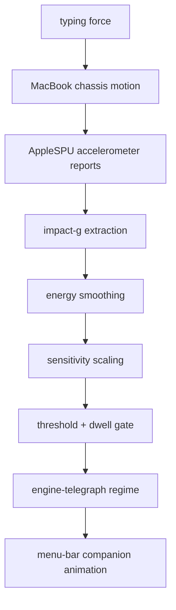

<h1 align="center">KeyMood</h1>

<p align="center">
  
</p>

<p align="center">
  
</p>

<p align="center">
  <strong>A tiny macOS menu-bar character that reacts to how hard you type.</strong><br />
  KeyMood turns local MacBook motion-sensor energy into a live companion state.<br /><br />
  No typed text. No key logging. No cloud model. No Python backend.
</p>

<p align="center">
  <a href="https://github.com/Everyseok/keymood">
    
  </a>
  
  
  
  
</p>

---

## What Makes It Different

| Usual menu-bar pet | KeyMood |
|---|---|
| Changes by timer, CPU load, or manual mode | Changes by physical typing force |
| Reads keyboard events or app activity | Reads local MacBook motion energy |
| Shows a status label first | Uses the character itself as the menu-bar signal |
| Jumps directly between states | Uses dwell and relaxation so motion feels alive |
| Needs cloud AI or a background service | Runs locally as a small Swift menu-bar app |

KeyMood is not a keylogger and not a chat-based mood app. It treats typing force as a chassis-motion signal: the MacBook body moves slightly when you type, the local accelerometer reports that motion, and app-owned Swift logic maps the signal into deterministic companion regimes.

---

## Supported MacBooks

Apple does not publish a full public AppleSPU accelerometer compatibility matrix for third-party apps. This target list is based on Apple's current motion-sensor feature boundary for Mac laptops and teardown evidence for the M2 MacBook Air.

| Status | MacBook models |
|---|---|
| Confirmed hardware evidence | MacBook Air 13-inch (M2, 2022) |
| Expected target | MacBook Air 13-inch/15-inch (M2, 2022-2023) |
| Expected target | MacBook Air 13-inch/15-inch (M3, 2024) |
| Expected target | MacBook Air 13-inch/15-inch (M4, 2025) |
| Expected target | MacBook Pro 13-inch (M2, 2022) |
| Expected target | MacBook Pro 14-inch/16-inch (M1 Pro/M1 Max, 2021) |
| Expected target | MacBook Pro 14-inch/16-inch (M2 Pro/M2 Max, 2023) |
| Expected target | MacBook Pro 14-inch/16-inch (M3/M3 Pro/M3 Max, 2023-2024) |
| Expected target | MacBook Pro 14-inch/16-inch (M4/M4 Pro/M4 Max, 2024-2025) |
| Not a target | Desktop Macs: iMac, Mac mini, Mac Studio, Mac Pro |
| Not a target | MacBook Air (M1, 2020), 13-inch MacBook Pro (M1, 2020), MacBook Neo, and earlier Mac laptops |

References:

- Apple says Vehicle Motion Cues are available on Mac laptop computers, but not on MacBook Neo, MacBook Air (M1), 13-inch MacBook Pro (M1), or earlier models: [Apple Support](https://support.apple.com/guide/mac-help/customize-onscreen-motion-mchlc03f57a1/mac).
- iFixit identified a Bosch Sensortec 6-axis accelerometer/gyroscope in the M2 MacBook Air logic board: [iFixit teardown](https://www.ifixit.com/News/62674/m2-macbook-air-teardown-apple-forgot-the-heatsink).

If a MacBook does not expose usable raw sensor reports, KeyMood still launches and shows `No Sensor`.

---

## Core Properties

- **Typing-force driven**: stronger physical typing produces stronger character regimes.
- **Motion-only input**: KeyMood uses accelerometer deltas, not typed content.
- **Menu-bar native**: the selected character is the status item; controls live in a standard macOS menu.
- **Stateful motion**: thresholds, dwell, sensitivity, and relaxation prevent one-frame noise from becoming a fake intense state.
- **Small local runtime**: the current app bundle is about 380 KB, and the zip artifact is about 104 KB.

---

## Local Motion Runtime

| Layer | Value |
|---|---|
| App type | Swift macOS menu-bar app |
| Minimum macOS | macOS 14 |
| Sensor path | Local AppleSPU / HID motion reports |
| Input signal | Accelerometer vector deltas |
| Primary metric | `impact_g` |
| Smoothed metric | `energy` |
| User tuning | `Sensitivity` slider, 0-100 |
| State control | Thresholds + dwell gate + relaxation path |
| Menu-bar output | Animated companion regime |
| Privacy boundary | No typed text, key names, key codes, prompts, or cloud calls |



---

## Regimes

| Internal state | User-facing regime | Character behavior |
|---|---|---|
| `calm` | `Dead Slow` | Barely moving |
| `focused` | `Slow Ahead` | Steady and calm |
| `charged` | `Half Ahead` | Faster, more energetic |
| `intense` | `Full Ahead` | Maximum shake and motion |
| `relaxing` | `Standby` | Cooling down |

The first companion direction is a tiny white submarine/engine pet. Stronger regimes increase propeller speed, body motion, smoke, splash, and eye intensity. Character assets live in `docs/assets/character/`.

---

## Quick Start

KeyMood is distributed as a source-first GitHub project. Clone the repository and run it locally.

Run from source:

```bash
git clone https://github.com/Everyseok/keymood.git
cd keymood
swift run keymood-menubar
```

Build and open the local app bundle:

```bash
git clone https://github.com/Everyseok/keymood.git
cd keymood
./scripts/build_app_bundle.sh
open output/KeyMood.app
```

---

## Verification

Basic checks:

```bash
swift test
```

Release bundle smoke check:

```bash
./scripts/build_app_bundle.sh
./scripts/smoke_app_bundle.sh
```

---

## Requirements

| Requirement | Version / Note |
|---|---|
| macOS | `>= 14` |
| Swift | Swift 6 toolchain / Xcode Command Line Tools |
| Hardware | Supported MacBook with usable AppleSPU motion reports |
| Network | Required only for `git clone` |
| App size | About 380 KB for `KeyMood.app`; about 104 KB for `KeyMood.zip` |

---

## Troubleshooting

| Symptom | Fix |
|---|---|
| `No Sensor` | This Mac may not expose usable AppleSPU motion reports. Try a supported MacBook model. |
| Character feels too quiet | Increase `Sensitivity` from the menu. |
| Character feels too intense | Lower `Sensitivity` from the menu. |
| App bundle does not open | Rebuild with `./scripts/build_app_bundle.sh`, then open `output/KeyMood.app`. |

---

## Distribution Notes

The default bundle script creates `output/KeyMood.app` and `output/KeyMood.zip`, then ad-hoc signs the app for local testing.

Public macOS distribution should use Developer ID signing and Apple notarization. AppleSPU raw sensor access is not a public App Store API, so KeyMood is designed first as a local GitHub/Developer ID MacBook app.

---

## Runtime Contract

KeyMood treats sensor input as local physical telemetry, not user content.

The runtime reads accelerometer motion deltas only. It does not read typed text, key names, key codes, prompts, focused app content, URLs, screenshots, or clipboard data. Swift-owned logic maps motion energy into fixed regimes, then the renderer updates only the known menu-bar character states.

---

## License

KeyMood is released under the Apache License 2.0.

Commercial use is permitted, but redistributions must retain the license terms and the attribution notice:

```text
Copyright 2026 junseokism
```

See [LICENSE](LICENSE) and [NOTICE](NOTICE) for the full terms and attribution notice.

---

## Author

**Jun Seok Kim**<br />
GitHub: [@Everyseok](https://github.com/Everyseok)

---

<p align="center">
  <strong>Typing force. Local motion. Menu-bar life.</strong>
</p>
