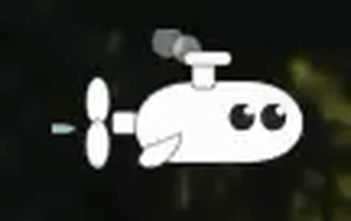

# KeyMood

<p align="center">
  
</p>

<p align="center">
  <strong>A tiny macOS menu-bar character that reacts to how hard you type.</strong><br />
  KeyMood turns local MacBook motion-sensor energy into a live companion state.
</p>

<p align="center">
  No typed text. No key logging. No cloud model. No Python backend.
</p>

---

## Menu Bar Preview

<p align="center">
  
</p>

---

## What It Does

| Physical input | Local processing | Menu-bar output |
|---|---|---|
| MacBook body vibration from typing | AppleSPU accelerometer samples -> impact-g -> smoothed energy | A small animated character changes regime |
| Softer typing | Low energy, short spikes ignored | `Dead Slow` or `Slow Ahead` |
| Firmer typing | Higher sustained energy after dwell filtering | `Half Ahead` or `Full Ahead` |
| Typing settles down | Relax path with decay instead of instant reset | `Standby` |

KeyMood does not infer emotion from what you type. It uses how the MacBook physically moves while you type, then maps that motion into a menu-bar companion state.

---

## Supported MacBooks

Apple does not publish a full public AppleSPU accelerometer compatibility matrix for third-party apps. KeyMood's target list is based on Apple's current motion-sensor feature boundary for Mac laptops and teardown evidence for the M2 MacBook Air.

| Status | MacBook models |
|---|---|
| Confirmed hardware evidence | MacBook Air 13-inch (M2, 2022) |
| Expected target | MacBook Air 13-inch/15-inch (M2, 2022-2023) |
| Expected target | MacBook Air 13-inch/15-inch (M3, 2024) |
| Expected target | MacBook Air 13-inch/15-inch (M4, 2025) |
| Expected target | MacBook Pro 13-inch (M2, 2022) |
| Expected target | MacBook Pro 14-inch/16-inch (M1 Pro/M1 Max, 2021) |
| Expected target | MacBook Pro 14-inch/16-inch (M2 Pro/M2 Max, 2023) |
| Expected target | MacBook Pro 14-inch/16-inch (M3/M3 Pro/M3 Max, 2023-2024) |
| Expected target | MacBook Pro 14-inch/16-inch (M4/M4 Pro/M4 Max, 2024-2025) |
| Not a target | Desktop Macs: iMac, Mac mini, Mac Studio, Mac Pro |
| Not a target | MacBook Air (M1, 2020), 13-inch MacBook Pro (M1, 2020), MacBook Neo, and earlier Mac laptops |

References:

- Apple says Vehicle Motion Cues are available on Mac laptop computers, but not on MacBook Neo, MacBook Air (M1), 13-inch MacBook Pro (M1), or earlier models: [Apple Support](https://support.apple.com/guide/mac-help/customize-onscreen-motion-mchlc03f57a1/mac).
- iFixit identified a Bosch Sensortec 6-axis accelerometer/gyroscope in the M2 MacBook Air logic board: [iFixit teardown](https://www.ifixit.com/News/62674/m2-macbook-air-teardown-apple-forgot-the-heatsink).

If a model does not expose usable raw sensor reports to KeyMood, the app still launches and shows `No Sensor`.

---

## Signal Logic

KeyMood treats typing force as a chassis-motion signal.

When a key is pressed, the force travels through the keyboard deck and produces a small impulse in the MacBook body. On supported models, the local motion sensor reports high-rate acceleration samples. KeyMood does not need the key name, typed character, focused app, or text content.

The runtime reduces raw motion into a compact signal:

```text
a(t)        = raw local acceleration vector
impact_g   = ||a(t) - a(t - 1)||
energy(t)  = smoothed normalized impact over a short time window
regime(t)  = threshold + dwell + relaxation state machine
```

The important part is the dwell filter. A single desk bump should not instantly become `Full Ahead`. The high-energy target must remain active long enough before the visible character commits to the stronger regime. When the signal drops, KeyMood enters `Standby` and relaxes down instead of snapping back.

| Stage | Purpose |
|---|---|
| Raw AppleSPU reports | Read only local accelerometer motion |
| Impact-g extraction | Convert frame-to-frame acceleration delta into physical typing impulse |
| Energy smoothing | Separate sustained typing force from one-frame noise |
| Sensitivity scaling | Let each MacBook/user tune the same signal path |
| Dwell gate | Require sustained force before stronger states appear |
| Relax path | Let the character cool down naturally after intense typing |

---

## Quick Start

Current release artifact size is small:

| Artifact | Local size |
|---|---:|
| `output/KeyMood.app` | about 380 KB |
| `output/KeyMood.zip` | about 104 KB |

Run from source:

```bash
git clone https://github.com/Everyseok/keymood.git && cd keymood && swift run keymood-menubar
```

Build and open the local app bundle:

```bash
git clone https://github.com/Everyseok/keymood.git && cd keymood && ./scripts/build_app_bundle.sh && open output/KeyMood.app
```

Requirements:

| Requirement | Version / note |
|---|---|
| macOS | 14 or newer |
| Swift | Swift 6 toolchain / Xcode Command Line Tools |
| Hardware | Supported MacBook with usable AppleSPU motion reports |
| Network | Only needed for `git clone` |

---

## Menu Bar Runtime

The app lives in the macOS menu bar. The menu-bar item is the selected character only; status text stays inside the menu.

Current menu:

| Control | Behavior |
|---|---|
| Regime rail | Shows `Dead Slow -> Slow Ahead -> Half Ahead -> Full Ahead -> Standby` and highlights the current regime |
| Character | Switches between available companion styles |
| Current | Shows the active user-facing regime |
| Sensitivity | Adjusts how strongly motion energy affects regime changes |
| Roaming Mode | Lets the character travel across its menu-bar track |
| Pause / Resume | Temporarily freezes sensor-driven updates |
| Quit KeyMood | Exits the app |

Runtime naming is split on purpose. Code keeps compact semantic states; the UI uses engine-telegraph language:

| Internal state | User-facing regime |
|---|---|
| `calm` | `Dead Slow` |
| `focused` | `Slow Ahead` |
| `charged` | `Half Ahead` |
| `intense` | `Full Ahead` |
| `relaxing` | `Standby` |

---

## Character System

The first companion direction is a tiny white submarine/engine pet. Stronger regimes increase propeller speed, body motion, smoke, splash, and eye intensity.

The character assets live in `docs/assets/character/`. See `docs/character-design.md` for the regime-by-regime visual contract.

---

## Probe Tools

List HID/SPU sensor candidates:

```bash
swift run keymood-probe sensors
```

Stream AppleSPU raw accelerometer impact energy:

```bash
swift run keymood-probe raw-stream --seconds 15
```

Convert the signal into stable runtime regimes:

```bash
swift run keymood-probe mood-stream --seconds 30 --dwell 1.0
```

Run guided soft-vs-firm typing calibration:

```bash
swift run keymood-probe calibrate --rounds 2 --repeats 3
```

If macOS blocks raw sensor access, build once and run the compiled probe with sudo:

```bash
swift build
sudo .build/debug/keymood-probe raw-stream --seconds 15
```

---

## Verification

Run the core checks:

```bash
swift test
```

Build the local app bundle:

```bash
./scripts/build_app_bundle.sh
```

Smoke-test the release bundle:

```bash
./scripts/smoke_app_bundle.sh
```

---

## Distribution Notes

The default bundle script creates `output/KeyMood.app` and `output/KeyMood.zip`, then ad-hoc signs the app for local testing.

Public macOS distribution should use Developer ID signing and Apple notarization:

```bash
KEYMOOD_SIGN_IDENTITY="Developer ID Application: Your Name (TEAMID)" \
KEYMOOD_NOTARIZE=1 \
KEYMOOD_NOTARY_PROFILE="keymood-notary" \
./scripts/build_app_bundle.sh
```

Check local distribution readiness:

```bash
./scripts/check_distribution_readiness.sh
```

Store a notary keychain profile before notarized builds:

```bash
./scripts/store_notary_profile.sh
```

AppleSPU raw sensor access is not a public App Store API. KeyMood is designed first as a local GitHub/Developer ID MacBook app.

---

## Privacy Contract

| KeyMood does | KeyMood does not do |
|---|---|
| Reads local accelerometer motion deltas | Read typed text |
| Computes impact-g and smoothed energy | Store key names or key codes |
| Maps physical force into character regimes | Send prompts or sensor data to a server |
| Lets the user tune sensitivity locally | Use a hosted AI model |

---

## License

KeyMood is released under the Apache License 2.0.

Commercial use is permitted, but redistributions must retain the license terms and the attribution notice:

```text
Copyright 2026 junseokism
```

See [LICENSE](LICENSE) and [NOTICE](NOTICE) for the full terms and attribution notice.
